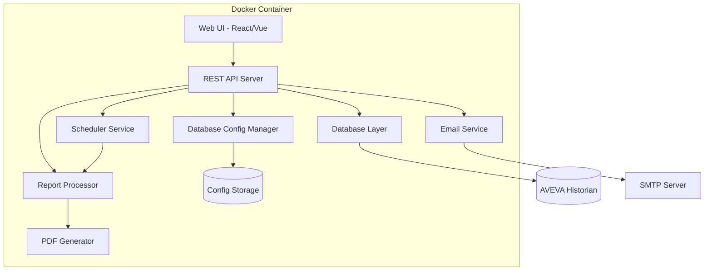

# Design Document: Historian Reporting Application

## Overview

The Historian Reports Application is a containerized web-based system that extracts historical time-series data from AVEVA Historian databases, processes it for trend analysis, and generates professional printable reports. The system supports both on-demand and automated scheduled reporting with email delivery capabilities.

The application follows a microservices architecture with clear separation of concerns, containerized deployment supporting both ARM and AMD64 architectures, and a modern web-based user interface for report configuration and management.

## Architecture

### High-Level Architecture



### Technology Stack

**Backend Framework**: Node.js with Express.js
- Mature ecosystem with excellent PDF generation libraries
- Strong support for time-series data processing
- Robust Docker multi-architecture support
- Rich library ecosystem for charts and data visualization

**Frontend Framework**: React.js
- Component-based architecture for modular UI development
- Excellent charting libraries (Chart.js, Recharts)
- Strong TypeScript support for type safety
- Responsive design capabilities

**Database Connectivity**: 
- MSSQL driver for AVEVA Historian connectivity
- Connection pooling for performance optimization
- Read-only access with proper security controls

**Report Generation**:
- PDFKit for PDF document generation
- Chart.js for data visualization
- Handlebars for report templating
- Sharp for image processing

**Containerization**:
- Multi-stage Docker builds for optimized images
- Docker Buildx for multi-architecture support (ARM64/AMD64)
- Environment-based configuration management

## Components and Interfaces

### 1. Database Layer (Data_Processor)

**Purpose**: Handles all interactions with AVEVA Historian database

**Key Interfaces**:
```typescript
interface HistorianConnection {
  connect(config: DatabaseConfig): Promise<Connection>
  disconnect(): Promise<void>
  executeQuery(query: string, params?: any[]): Promise<QueryResult>
}

interface DataRetrieval {
  getTimeSeriesData(tagName: string, startTime: Date, endTime: Date): Promise<TimeSeriesData[]>
  getTagList(filter?: string): Promise<TagInfo[]>
  validateConnection(): Promise<boolean>
}

interface TrendAnalysis {
  calculateTrendLine(data: TimeSeriesData[]): TrendResult
  detectAnomalies(data: TimeSeriesData[], threshold: number): AnomalyResult[]
  computeMovingAverage(data: TimeSeriesData[], windowSize: number): TimeSeriesData[]
  calculateStatistics(data: TimeSeriesData[]): StatisticsResult
}
```

**AVEVA Historian Integration**:
- Connects to Historian's SQL Server interface
- Utilizes Historian's time-series optimized queries
- Supports Historian's retrieval modes (Cyclic, Delta, Full, BestFit)
- Handles Historian's unique timestamp and quality value formats

**Auto-Update Mechanism**:
```typescript
interface AutoUpdateService {
  startAutoUpdate(config: AutoUpdateConfig): void
  stopAutoUpdate(sessionId: string): void
  updateInterval: 30 | 60 // seconds
}
```

### 2. Report Generator (Report_Generator)

**Purpose**: Creates professional PDF reports with embedded charts and data

**Key Interfaces**:
```typescript
interface ReportGenerator {
  generateReport(config: ReportConfig): Promise<Buffer>
  createTemplate(template: ReportTemplate): Promise<string>
  embedChart(chartConfig: ChartConfig): Promise<ChartImage>
}

interface ChartGenerator {
  createLineChart(data: TimeSeriesData[], options: ChartOptions): Promise<Buffer>
  createBarChart(data: AggregatedData[], options: ChartOptions): Promise<Buffer>
  createTrendChart(data: TimeSeriesData[], trend: TrendResult): Promise<Buffer>
}
```

**Report Templates**:
- Handlebars-based templating system
- Support for company branding and custom layouts
- Dynamic content insertion with data binding
- Professional formatting with consistent styling

### 3. Scheduler Service (Scheduler)

**Purpose**: Manages automated report generation and execution

**Key Interfaces**:
```typescript
interface SchedulerService {
  createSchedule(schedule: ScheduleConfig): Promise<string>
  updateSchedule(scheduleId: string, config: ScheduleConfig): Promise<void>
  deleteSchedule(scheduleId: string): Promise<void>
  executeSchedule(scheduleId: string): Promise<ExecutionResult>
}

interface ScheduleConfig {
  reportConfig: ReportConfig
  interval: 'hourly' | '6h' | '8h' | '12h' | 'daily' | 'weekly' | 'monthly'
  recipients: string[]
  enabled: boolean
}
```

**Scheduling Implementation**:
- Cron-based scheduling using node-cron
- Persistent schedule storage in SQLite
- Error handling and retry mechanisms
- Execution logging and monitoring

### 4. Email Delivery System (Email_Delivery_System)

**Purpose**: Handles automated report distribution via email

**Key Interfaces**:
```typescript
interface EmailService {
  sendReport(report: Buffer, config: EmailConfig): Promise<DeliveryResult>
  validateEmailConfig(config: EmailConfig): Promise<boolean>
  getDeliveryStatus(messageId: string): Promise<DeliveryStatus>
}

interface EmailConfig {
  recipients: string[]
  subject: string
  body: string
  attachmentName: string
  smtpConfig: SMTPConfig
}
```

### 6. Database Configuration Manager (Database_Configuration_Manager)

**Purpose**: Manages database connection settings through a secure web interface

**Key Interfaces**:
```typescript
interface DatabaseConfigManager {
  saveConfiguration(config: DatabaseConfig): Promise<string>
  loadConfiguration(configId: string): Promise<DatabaseConfig>
  testConnection(config: DatabaseConfig): Promise<ConnectionTestResult>
  deleteConfiguration(configId: string): Promise<void>
  listConfigurations(): Promise<DatabaseConfigSummary[]>
}

interface DatabaseConfig {
  id?: string
  name: string
  host: string
  port: number
  database: string
  username: string
  password: string
  encrypt: boolean
  trustServerCertificate: boolean
  connectionTimeout: number
  requestTimeout: number
}

interface ConnectionTestResult {
  success: boolean
  message: string
  responseTime?: number
  serverVersion?: string
  error?: string
}

interface DatabaseConfigSummary {
  id: string
  name: string
  host: string
  database: string
  isActive: boolean
  lastTested: Date
  status: 'connected' | 'disconnected' | 'error' | 'untested'
}
```

**Security Features**:
- AES-256 encryption for stored passwords
- Role-based access control for configuration management
- Audit logging for all configuration changes
- Secure credential validation and sanitization

**Configuration Management**:
```typescript
interface ConfigurationService {
  encryptCredentials(config: DatabaseConfig): Promise<EncryptedConfig>
  decryptCredentials(encryptedConfig: EncryptedConfig): Promise<DatabaseConfig>
  validateConfiguration(config: DatabaseConfig): ValidationResult
  switchActiveConfiguration(configId: string): Promise<void>
}
```

### 7. Web User Interface (User_Interface)

**Purpose**: Provides intuitive web-based interface for report management

**Key Components**:
- Dashboard with report overview and quick actions
- Report configuration wizard with step-by-step guidance
- Time range picker with calendar integration
- Tag browser with search and filtering capabilities
- Report preview with real-time data visualization
- Schedule management interface
- User authentication and role management
- **Database configuration interface with connection testing**
- **Secure credential management with encryption**

**API Endpoints**:
```typescript
// Data endpoints
GET /api/tags - Get available tags
GET /api/data/:tagName - Get time-series data
POST /api/data/query - Execute custom data query

// Report endpoints
POST /api/reports/generate - Generate report
GET /api/reports/:id - Get saved report
POST /api/reports/save - Save report configuration
DELETE /api/reports/:id - Delete saved report

// Schedule endpoints
POST /api/schedules - Create schedule
GET /api/schedules - List schedules
PUT /api/schedules/:id - Update schedule
DELETE /api/schedules/:id - Delete schedule

// Database configuration endpoints
GET /api/database/configs - List database configurations
POST /api/database/configs - Create database configuration
PUT /api/database/configs/:id - Update database configuration
DELETE /api/database/configs/:id - Delete database configuration
POST /api/database/test - Test database connection
POST /api/database/activate/:id - Activate database configuration

// System endpoints
GET /api/health - Health check
POST /api/auth/login - User authentication
```

## Data Models

### Core Data Structures

```typescript
interface TimeSeriesData {
  timestamp: Date
  value: number
  quality: QualityCode
  tagName: string
}

interface TagInfo {
  name: string
  description: string
  units: string
  dataType: 'analog' | 'discrete' | 'string'
  lastUpdate: Date
}

interface ReportConfig {
  id: string
  name: string
  description: string
  tags: string[]
  timeRange: TimeRange
  chartTypes: ChartType[]
  template: string
  filters: DataFilter[]
  createdBy: string
  createdAt: Date
}

interface TimeRange {
  startTime: Date
  endTime: Date
  relativeRange?: 'last1h' | 'last24h' | 'last7d' | 'last30d'
}

interface TrendResult {
  slope: number
  intercept: number
  correlation: number
  equation: string
  confidence: number
}

interface StatisticsResult {
  min: number
  max: number
  average: number
  standardDeviation: number
  count: number
  dataQuality: number
}

interface DatabaseConfiguration {
  id: string
  name: string
  host: string
  port: number
  database: string
  username: string
  encryptedPassword: string
  encrypt: boolean
  trustServerCertificate: boolean
  connectionTimeout: number
  requestTimeout: number
  isActive: boolean
  createdBy: string
  createdAt: Date
  lastTested?: Date
  status: 'connected' | 'disconnected' | 'error' | 'untested'
}

interface ConnectionTestResult {
  success: boolean
  message: string
  responseTime?: number
  serverVersion?: string
  error?: string
  testedAt: Date
}
```

### Database Schema (SQLite for Application Data)

```sql
-- Report configurations
CREATE TABLE reports (
  id TEXT PRIMARY KEY,
  name TEXT NOT NULL,
  description TEXT,
  config JSON NOT NULL,
  created_by TEXT,
  created_at DATETIME DEFAULT CURRENT_TIMESTAMP,
  updated_at DATETIME DEFAULT CURRENT_TIMESTAMP
);

-- Scheduled reports
CREATE TABLE schedules (
  id TEXT PRIMARY KEY,
  report_id TEXT REFERENCES reports(id),
  interval_type TEXT NOT NULL,
  cron_expression TEXT NOT NULL,
  recipients JSON NOT NULL,
  enabled BOOLEAN DEFAULT true,
  last_execution DATETIME,
  next_execution DATETIME,
  created_at DATETIME DEFAULT CURRENT_TIMESTAMP
);

-- Execution history
CREATE TABLE executions (
  id TEXT PRIMARY KEY,
  schedule_id TEXT REFERENCES schedules(id),
  report_id TEXT REFERENCES reports(id),
  status TEXT NOT NULL,
  started_at DATETIME NOT NULL,
  completed_at DATETIME,
  error_message TEXT,
  file_size INTEGER
);

-- User sessions and authentication
CREATE TABLE users (
  id TEXT PRIMARY KEY,
  username TEXT UNIQUE NOT NULL,
  email TEXT,
  role TEXT DEFAULT 'user',
  created_at DATETIME DEFAULT CURRENT_TIMESTAMP
);

-- Database configurations
CREATE TABLE database_configurations (
  id TEXT PRIMARY KEY,
  name TEXT NOT NULL,
  host TEXT NOT NULL,
  port INTEGER NOT NULL,
  database_name TEXT NOT NULL,
  username TEXT NOT NULL,
  encrypted_password TEXT NOT NULL,
  encrypt BOOLEAN DEFAULT true,
  trust_server_certificate BOOLEAN DEFAULT false,
  connection_timeout INTEGER DEFAULT 30000,
  request_timeout INTEGER DEFAULT 30000,
  is_active BOOLEAN DEFAULT false,
  created_by TEXT REFERENCES users(id),
  created_at DATETIME DEFAULT CURRENT_TIMESTAMP,
  updated_at DATETIME DEFAULT CURRENT_TIMESTAMP,
  last_tested DATETIME,
  status TEXT DEFAULT 'untested'
);

-- Configuration test history
CREATE TABLE connection_tests (
  id TEXT PRIMARY KEY,
  config_id TEXT REFERENCES database_configurations(id),
  success BOOLEAN NOT NULL,
  message TEXT,
  response_time INTEGER,
  server_version TEXT,
  error_details TEXT,
  tested_at DATETIME DEFAULT CURRENT_TIMESTAMP,
  tested_by TEXT REFERENCES users(id)
);
```

## Correctness Properties

*A property is a characteristic or behavior that should hold true across all valid executions of a system—essentially, a formal statement about what the system should do. Properties serve as the bridge between human-readable specifications and machine-verifiable correctness guarantees.*

Now I need to analyze the acceptance criteria to determine which ones can be tested as properties.

Based on the prework analysis, I'll now convert the testable acceptance criteria into correctness properties:

### Property 1: Database Authentication and Security
*For any* database connection configuration, the system should authenticate using the specified method and maintain read-only access permissions throughout the session
**Validates: Requirements 1.1, 1.2, 9.2**

### Property 2: Time Range Data Retrieval
*For any* specified time range, all returned data points should have timestamps that fall within the start and end boundaries (inclusive)
**Validates: Requirements 2.1**

### Property 3: Data Filtering Consistency
*For any* combination of filter criteria (tag names, data quality, value ranges), all returned data should satisfy every specified filter condition
**Validates: Requirements 2.2, 2.5**

### Property 4: Statistical Calculation Correctness
*For any* dataset, calculated statistics (average, min, max, standard deviation, trend lines, moving averages, percentage changes) should be mathematically correct within acceptable floating-point precision
**Validates: Requirements 2.4, 3.1, 3.3, 3.4**

### Property 5: Pagination Memory Management
*For any* dataset larger than the configured page size, the system should process data in chunks without exceeding memory thresholds
**Validates: Requirements 2.3, 10.1**

### Property 6: Anomaly and Pattern Detection
*For any* dataset with known anomalies or pattern changes, the system should correctly identify and flag these deviations based on configured thresholds
**Validates: Requirements 3.2, 3.5**

### Property 7: Auto-Update Timing Consistency
*For any* auto-update configuration with 30 or 60-second intervals, trend data refreshes should occur at the specified intervals with acceptable timing variance (±5%)
**Validates: Requirements 3.6, 3.7**

### Property 8: Report Generation Completeness
*For any* report configuration, the generated PDF should contain all specified elements (charts, tables, metadata, branding) and be a valid PDF document
**Validates: Requirements 4.1, 4.2, 4.3, 4.4, 4.5**

### Property 9: Report Configuration Round-Trip
*For any* saved report configuration, retrieving and loading it should produce an equivalent configuration to the original
**Validates: Requirements 6.1, 6.2, 6.5**

### Property 10: Schedule Execution Timing
*For any* configured schedule interval, report generation should occur at the calculated execution times with acceptable variance (±30 seconds)
**Validates: Requirements 7.1, 7.2**

### Property 11: Concurrent Request Handling
*For any* number of simultaneous report generation requests up to the configured limit, all requests should complete successfully without resource conflicts
**Validates: Requirements 7.3, 10.2**

### Property 12: Error Handling and Retry Logic
*For any* system component that encounters failures, retry attempts should follow exponential backoff patterns with configured maximum retry limits
**Validates: Requirements 1.4, 7.4, 8.4**

### Property 13: Email Delivery Completeness
*For any* report delivery configuration, sent emails should contain the specified recipients, subject, body, and report attachment
**Validates: Requirements 8.1, 8.2, 8.3**

### Property 14: Security and Encryption
*For any* sensitive data (credentials, connections), the system should apply appropriate encryption both in transit and at rest
**Validates: Requirements 9.3, 8.5**

### Property 15: Authentication and Authorization
*For any* user access attempt, the system should enforce authentication requirements and role-based access controls
**Validates: Requirements 9.1, 9.5**

### Property 16: Audit Logging Completeness
*For any* user action or system event, an audit log entry should be created with timestamp, user, action, and outcome
**Validates: Requirements 9.4, 7.5**

### Property 17: Multi-Architecture Container Compatibility
*For any* supported architecture (ARM64, AMD64), the containerized application should build successfully and run with identical functionality
**Validates: Requirements 11.1, 11.2, 11.5**

### Property 18: Environment Configuration
*For any* environment variable configuration, the application should use the provided values for database connections and system settings
**Validates: Requirements 11.3**

### Property 19: Health Check Reliability
*For any* container startup, health checks should accurately report the operational status of all system components
**Validates: Requirements 11.4**

### Property 20: Performance Optimization
*For any* database query or report generation operation, the system should apply appropriate optimizations (caching, query optimization, progress reporting) to maintain acceptable performance
**Validates: Requirements 10.3, 10.4, 10.5**

### Property 21: Database Configuration Encryption
*For any* database configuration with credentials, the stored version should have encrypted passwords while the original plaintext passwords should be recoverable through decryption
**Validates: Requirements 9.3**

### Property 22: Database Configuration Round-Trip
*For any* valid database configuration, saving then loading the configuration should produce an equivalent configuration with properly decrypted credentials
**Validates: Requirements 9.4**

### Property 23: Connection Testing Validation
*For any* database configuration (valid or invalid), the connection test should return appropriate success/failure status with meaningful error messages for failures
**Validates: Requirements 9.2**

### Property 24: Active Configuration Switching
*For any* database configuration switch, the active connection pool should be updated to use the new configuration settings
**Validates: Requirements 9.5**

### Property 25: Database Configuration Access Control
*For any* user without administrator privileges, attempts to modify database configurations should be rejected with appropriate authorization errors
**Validates: Requirements 9.6**

### Property 26: Database Configuration Validation
*For any* invalid database configuration (missing required fields, invalid ports, malformed hostnames), the system should prevent saving and return specific validation error messages
**Validates: Requirements 9.7**

## Error Handling

### Database Connection Errors
- **Connection Failures**: Implement exponential backoff retry mechanism with configurable maximum attempts
- **Query Timeouts**: Set appropriate timeout values and provide user feedback for long-running queries
- **Schema Validation**: Validate AVEVA Historian schema compatibility before executing queries
- **Data Quality Issues**: Handle and flag poor quality data points with appropriate user notifications

### Report Generation Errors
- **Template Errors**: Validate report templates before processing and provide detailed error messages
- **Chart Generation Failures**: Implement fallback mechanisms for chart generation failures
- **PDF Creation Issues**: Handle memory constraints and file system errors during PDF generation
- **Large Dataset Handling**: Implement streaming and pagination to handle memory limitations

### Scheduling and Email Errors
- **Schedule Conflicts**: Queue overlapping scheduled reports and execute them sequentially
- **Email Delivery Failures**: Implement retry logic with exponential backoff for failed email deliveries
- **SMTP Configuration Issues**: Validate email configuration before attempting delivery
- **Attachment Size Limits**: Handle large report attachments with compression or alternative delivery methods

### System-Level Error Handling
- **Container Health Monitoring**: Implement comprehensive health checks for all system components
- **Resource Exhaustion**: Monitor memory and CPU usage with appropriate alerts and throttling
- **Authentication Failures**: Implement secure authentication with proper error logging
- **Configuration Errors**: Validate all configuration parameters at startup with clear error messages

## Testing Strategy

### Dual Testing Approach

The testing strategy employs both unit testing and property-based testing to ensure comprehensive coverage:

**Unit Tests**: Verify specific examples, edge cases, and error conditions
- Test specific report configurations with known expected outputs
- Verify error handling for invalid inputs and system failures
- Test integration points between components
- Validate specific AVEVA Historian query formats and responses

**Property-Based Tests**: Verify universal properties across all inputs
- Generate random time ranges, tag configurations, and report settings
- Test mathematical correctness of statistical calculations across diverse datasets
- Verify system behavior under various load conditions and input combinations
- Ensure security and authentication properties hold for all user scenarios

### Property-Based Testing Configuration

**Testing Framework**: Fast-check for Node.js property-based testing
- Minimum 100 iterations per property test to ensure comprehensive input coverage
- Custom generators for AVEVA Historian data structures and time-series data
- Shrinking capabilities to identify minimal failing examples when properties fail

**Test Organization**:
- Each correctness property implemented as a single property-based test
- Tests tagged with feature name and property reference for traceability
- Tag format: **Feature: historian-reporting, Property {number}: {property_text}**

**Custom Generators**:
```typescript
// Time-series data generator
const timeSeriesDataGen = fc.array(fc.record({
  timestamp: fc.date(),
  value: fc.float(),
  quality: fc.constantFrom('Good', 'Bad', 'Uncertain'),
  tagName: fc.string()
}));

// Report configuration generator
const reportConfigGen = fc.record({
  tags: fc.array(fc.string()),
  timeRange: fc.record({
    startTime: fc.date(),
    endTime: fc.date()
  }),
  chartTypes: fc.array(fc.constantFrom('line', 'bar', 'trend')),
  template: fc.string()
});
```

### Integration Testing

**Database Integration**:
- Test against AVEVA Historian test database with known data sets
- Verify SQL query generation and execution with various time ranges and filters
- Test connection pooling and error recovery mechanisms

**Report Generation Integration**:
- Test PDF generation with various chart types and data volumes
- Verify template rendering with different branding configurations
- Test multi-format output generation (PDF, DOCX)

**Email Integration**:
- Test email delivery with various SMTP configurations
- Verify attachment handling for different report sizes
- Test retry mechanisms with simulated email server failures

**Container Integration**:
- Test multi-architecture builds and deployments
- Verify environment variable configuration across different deployment scenarios
- Test health check endpoints and monitoring integration

### Performance Testing

**Load Testing**:
- Test concurrent report generation with multiple users
- Verify system performance with large historical datasets
- Test auto-update functionality under continuous load

**Memory Testing**:
- Verify streaming data processing with large datasets
- Test memory usage during concurrent operations
- Validate garbage collection and memory leak prevention

**Database Performance**:
- Test query optimization with various time ranges and tag combinations
- Verify caching effectiveness for frequently accessed data
- Test connection pooling under high load conditions